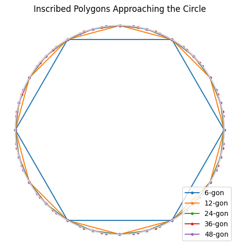

In the 3rd century, Chinese mathematician **Liu Hui** approximated π by inscribing regular polygons in a circle and letting the number of sides double. Let’s recreate his method in Python!


bala bala 




Play it, by changing the "n" variables.  [google colab](https://colab.research.google.com/drive/1Y7UxuLUH5x6t0dam55hmH56Ai_K78Lxy?usp=sharing)


---

## 1. Compute Perimeter Approximations

For a circle of radius 1:
- A regular \(n\)-gon inscribed in the circle has side length  
  \[
    s_n = 2\sin\Bigl(\frac\pi n\Bigr)
  \]
- Its perimeter \(P_n = n\,s_n\) is a lower bound for \(2\pi\).

As \(n\) doubles (6, 12, 24, …, 6·2^k), \(P_n/2\) quickly converges to π.

```python
import numpy as np
import matplotlib.pyplot as plt

# List of polygon sides: start from hexagon, double up to 1536
ns = [6 * 2**k for k in range(7)]  # [6,12,24,...,1536]
perimeters = [n * 2 * np.sin(np.pi / n) for n in ns]
approximations = [P/2 for P in perimeters]

plt.plot(ns, approximations, 'o-', label="P_n/2")
plt.axhline(np.pi, color='gray', linestyle='--', label="π")
plt.xscale('log', base=2)
plt.xlabel("Number of sides (n)")
plt.ylabel("Approximation of π")
plt.title("Liu Hui’s Inscribed Polygon π-Approximation")
plt.legend()
plt.grid(True, ls='--', alpha=0.5)
plt.show()
